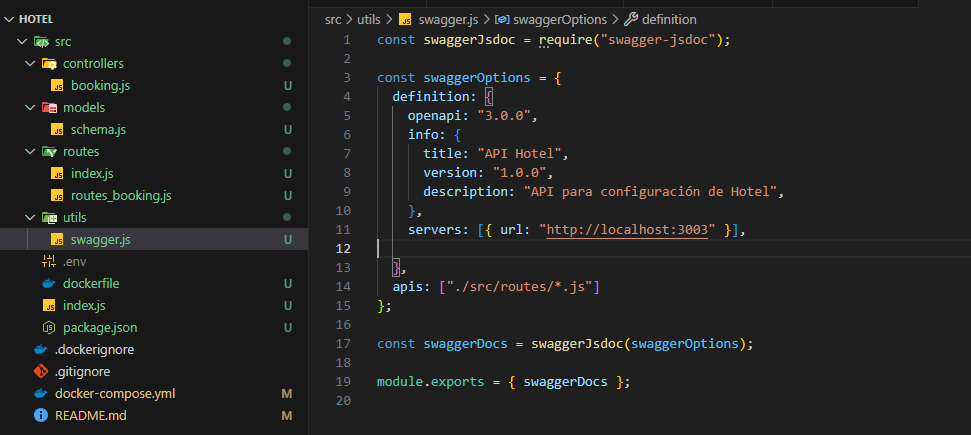

# Hotel-Booking
API para gestionar reservas de habitaciones en un hotel. Permite crear, listar y eliminar reservas de clientes. Implementada con un diseño frontend y documentación con Swagger.

# Despliegue de Aplicación Web en AWS EC2

## 📌 Descripción del Proyecto
API para gestionar reservas de habitaciones en un hotel. Permite crear, listar y eliminar reservas de clientes. Implementada con un diseño frontend y documentación con Swagger.
La aplicación seleccionada es **Hotel-Booking** y está preparada para ejecutarse en un entorno de producción en la nube.

---

## 🛠️ Tecnologías Utilizadas
- **Lenguaje:** JavaScript Node.js 
- **Servidor Web:** No tiene sin embargo se podria gestionar con Nginx
- **Cloud Provider:** Amazon Web Services (AWS)
- **Servicio de Infraestructura:** Amazon EC2
- **Sistema Operativo de la Instancia:** Ubuntu
- **Control de Versiones:** Git + GitHub

---

## 🌍 URL de la Aplicación
http://18.222.180.221:3003/api-docs

---

## 📋 Requisitos Previos
- tener instalado docker
- tener una cuenta en mongodb
- Tener conocimientos sobre swagger Documentacion de apis

---

## 🚀 Paso a Paso del Despliegue
1. Loguearse bajo la clave **.pem** de la instancia de aws para conectarnos mediante ssh en una terminal
2. Despues de tener el acceso a la instancia, clonamos el repositorio
```bash
# Clonar tu proyecto
git clone https://github.com/DanielCamiloR/Hotel.git
cd Hotel
```
3. si se a desplegado en el repositorio de github y queremos tener los cambios en la instancia de aws o "servidor" tendremos que seguir estos pasos:
- Detenemos la ejecucion del docker con este comando :
```bash
docker-compose stop
```
- actualizar la rama remota main para que pueda bajar los cambios a la rama local de main
```bash
# Con pull actualizamos la rama
git pull origin main
```
- por ultimo ponemos a ejecutar los contenedores con los nuevos cambios 
```bash
# No es necesario volver a darle build a la instruccion de docker 
# ya que si en los volumenes de docker tenemos informacion como logs del sistema estos se borraran.
# Ademas que solo necesitamos actualizar para no tener que volver a instalar de nuevos las dependencias.
docker-compose up -d 
```

>   
> Para una mejora en el despliegue se puede utilizar 

### 1️⃣ Preparación del Proyecto
**Local**
1. 
```bash
# Clonar tu proyecto
git clone https://github.com/DanielCamiloR/Hotel.git
cd Hotel
```
2. 
```bash
# Ejecutar proyecto con docker
docker-compose up -d --build
```
3. 
- Actualizar en el archivo **utils/swagger.js** la url de la aplicacion a **localhost:3003**


- si no quiere ejecutarlo con docker 
```bash
# Ejecutar proyecto sin docker 
npm i 
cd src
npm run start
```
- agregar el archivo .env para configurar la variable de entorno del sistema **MONGO_URI** y su uri corespondiente del clouster de mongo

**Aws**


